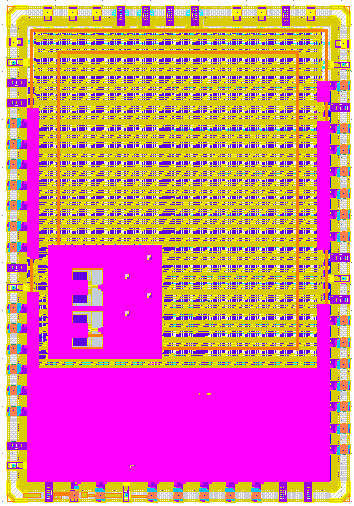

# System On Chip for CCD CubeSat Payload

[](https://opensource.org/licenses/Apache-2.0) [](https://github.com/efabless/caravel_user_project_analog/actions/workflows/user_project_ci.yml) [](https://github.com/efabless/caravel_user_project_analog/actions/workflows/caravan_build.yml)

---

## Digital nd Analog Chip

The following project presents the integration of the digital and the analog design parts in a System-on-Chip (SoC) that performs all the required Charge-Coupled Device (CCD) management. This CCD is embedded in an optical payload for the CubeSAT-UFSAT-1 mission. The whole SOC is designed, tested and integrated using open-source Electronic Design Automation (EDA) tools. The objective of the CubeSAt-UFSAT-1 CCD-payload is to capture images for the San Roque Lake's algae-concentration-studies. Such studies are important for researchs in groups related to the Gulich Institute (IG), among others. IG belongs both to the National University of Córdoba (UNC) and to CONAE, the Argentinian Space Agency. The CubeSat-UFSAT-1 mission is currently being developed at the IG.

## Glossary
`/gds` Contains the final GDS file of the Caravan chip, which integrates the digital and analog designs.
`/mag` Contains the layouts of all the designs
`/xschem` Contains all the schematics and testbenches for the analog components.
`/verilog/rtl` Contains all the Verilog files for the digital designs, including black boxes for the analog components.
`/verilog/dv/signal_generator` Contains all the scripts required for digital testing of the behavioral design already integrated into the Caravan chip.


## Install PDK

    https://xschem.sourceforge.io/stefan/xschem_man/tutorial_xschem_sky130.html

| Paso                                       | Comando                                              |
|--------------------------------------------|------------------------------------------------------|
| fetch the repository with git:             | `git clone git://opencircuitdesign.com/open_pdks`    |
| ingreso al directorio                      | `cd open_pdks`                                       |
| configure the build                        | `./configure --enable-sky130-pdk`                    |
| make                                       | `make`                                               |
| make install                               | `sudo make install`                                  |

## Run magic

    export PDK_ROOT=/usr/local/share/pdk/
    magic -d XR -rcfile $PDK_ROOT/sky130A/libs.tech/magic/sky130A.magicrc

    Para utilizar el pdk del repositorio y abrir user_analog_project_wrapper:

    export PDK_ROOT=/home/jona/Desktop/Repositorio_LAB/test_mixer/dependencies/pdks/
    magic -d XR -rcfile $PDK_ROOT/sky130A/libs.tech/magic/sky130A.magicrc mag/user_analog_project_wrapper.mag


## Run xschem

    cp /usr/local/share/pdk/sky130B/libs.tech/xschem/xschemrc .
    xterm &
    xschem

## Run netgen

    ln -s /usr/share/pdk/sky130A/libs.tech/netgen/sky130A_setup.tcl setup.tcl
    netgen -batch lvs "../xschem/example_por.spice example_por" "../mag/example_por.spice example_por"
    

## Commands to recreate the tests

- export CARAVEL_LITE=0

- make simenv

- make setup


- En ./verilog mgmt_core_wrapper/verilog/dv/firmware/defs.h comentar

```
    #define reg_debug_2 (*(volatile unsigned int*)(USER_SPACE_ADDR + USER_SPACE_SIZE))
    #define reg_debug_1 (*(volatile unsigned int*)(USER_SPACE_ADDR + USER_SPACE_SIZE - 4))    
```
- Modificar en mgmt_core_wrapper/verilog/dv/make/sim.makefile  

```
	ifeq ($(CONFIG),user_project_wrapper)
	por
    ifeq ($(CONFIG),user_analog_project_wrapper)
```


- Ejecutar make verify-signal?generator-rtl

	En caso de error en dependencies/pdks/sky130A/libs.ref/sky130_fd_io/verilog/sky130_ef_io.v comentar las lineas 1364/1365.
```	
	// .DRN_HVC(DRN_HVC),
	// .SRC_BDY_HVC(SRC_BDY_HVC),
```

- Dentro del directorio openlane ejecutar

	make signal_generator
	make user_analog_project_wrapper

- Finalmente en caravan ejecutar

	env USER_ID=0000000F make set_user_id 
	make gpio_defaults  
	ulimit -n 2024
	make truck



- Proximos pasos

	make run-precheck

_Comentarios_

```
Consistency is a strange check for analog designs. I think you can eliminate it my copying the extracted netlist precheck_results/28_MAR_2024___23_23_11/tmp/ext/user_analog_project_wrapper.gds.spice or precheck_results/28_MAR_2024___23_23_11/tmp/spice_fix/user_analog_project_wrapper.spice to netgen/user_analog_project_wrapper.spice.
```

Refer to [README](docs/source/index.rst) for this sample project documentation. 
