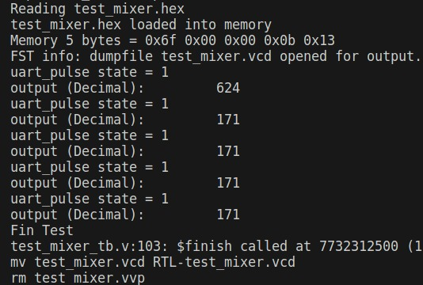
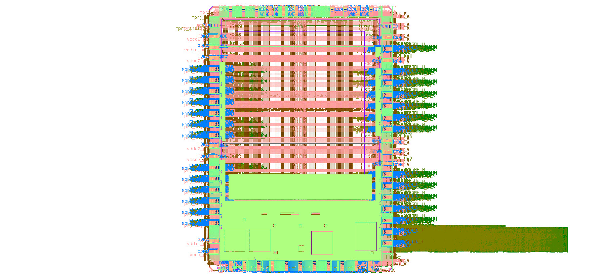

# Caravel Analog User

[](https://opensource.org/licenses/Apache-2.0) [](https://github.com/efabless/caravel_user_project_analog/actions/workflows/user_project_ci.yml) [](https://github.com/efabless/caravel_user_project_analog/actions/workflows/caravan_build.yml)

---

## Analog Chip

The following project implements an analog circuit from which we want to extract samples with digital circuits, for example, schim triger, and then a counter so that they are later analyzed in the riscV. The riscV can then send the data to the outside of the chip by using the UART.

## Install PDK

    https://xschem.sourceforge.io/stefan/xschem_man/tutorial_xschem_sky130.html

| Paso                                       | Comando                                              |
|--------------------------------------------|------------------------------------------------------|
| fetch the repository with git:             | `git clone git://opencircuitdesign.com/open_pdks`    |
| ingreso al directorio                      | `cd open_pdks`                                       |
| configure the build                        | `./configure --enable-sky130-pdk`                    |
| make                                       | `make`                                               |
| make install                               | `sudo make install`                                  |

## Run magic

    export PDK_ROOT=/usr/local/share/pdk/
    magic -d XR -rcfile $PDK_ROOT/sky130A/libs.tech/magic/sky130A.magicrc

    Para utilizar el pdk del repositorio y abrir user_analog_project_wrapper:

    export PDK_ROOT=/home/jona/Desktop/Repositorio_LAB/test_mixer/dependencies/pdks/
    magic -d XR -rcfile $PDK_ROOT/sky130A/libs.tech/magic/sky130A.magicrc mag/user_analog_project_wrapper.mag


## Run xschem

    cp /usr/local/share/pdk/sky130B/libs.tech/xschem/xschemrc .
    xterm &
    xschem

## Run netgen

    ln -s /usr/share/pdk/sky130A/libs.tech/netgen/sky130A_setup.tcl setup.tcl
    netgen -batch lvs "../xschem/example_por.spice example_por" "../mag/example_por.spice example_por"
    

## Commands

- export CARAVEL_LITE=0

- make simenv

- make setup


- En ./verilog mgmt_core_wrapper/verilog/dv/firmware/defs.h comentar

```
    #define reg_debug_2 (*(volatile unsigned int*)(USER_SPACE_ADDR + USER_SPACE_SIZE))
    #define reg_debug_1 (*(volatile unsigned int*)(USER_SPACE_ADDR + USER_SPACE_SIZE - 4))    
```
- Modificar en mgmt_core_wrapper/verilog/dv/make/sim.makefile  

```
	ifeq ($(CONFIG),user_project_wrapper)
	por
    ifeq ($(CONFIG),user_analog_project_wrapper)
```

- Modificacion en mgmt_core_wrapper/verilog/dv/vip/tbuart.v

```

    module tbuart (
    input  ser_rx,
    output  ser_tx
    );
	reg [3:0] recv_state;
	reg [2:0] recv_divcnt;
	reg [7:0] recv_pattern;
	reg [8*50-1:0] recv_buf_data;	// 50 characters.  Increase as needed for tests.
	reg [8*50-1:0] recv_buf_rev;	
	reg clk;
	integer i; // Variable para el bucle for
	integer hex_value; // Variable para almacenar el valor decimal
	initial begin
		clk <= 1'b0;
		recv_state <= 0;
		recv_divcnt <= 0;
		recv_pattern <= 0;
		recv_buf_data <= 0;
	end

	// NOTE:  Running at 3.0us clock period @ 5 clocks per bit = 15.0us per
	// bit ~= 64 kbaud. Not tuned to any particular UART.  Most run at
	// 9600 baud default and will bounce up to higher baud rates when
	// passed specific command words.

    //	always #1500 clk <= (clk === 1'b0);
        always #2650 clk <= (clk === 1'b0);  // working for 9600 baud
    //	always #125 clk <= (clk === 1'b0);

	always @(posedge clk) begin
		recv_divcnt <= recv_divcnt + 1;
		case (recv_state)
			0: begin
				if (!ser_rx)
					recv_state <= 1;
				recv_divcnt <= 0;
			end
			1: begin
				if (2*recv_divcnt > 3'd3) begin
					recv_state <= 2;
					recv_divcnt <= 0;
				end
			end
			10: begin
				if (recv_divcnt > 3'd3) begin
					// 0x0a = '\n'
					if (recv_pattern == 8'h0a) 
					begin
						// Invert the string before displaying
						for (i = 0; i < 50; i = i + 1) begin
							recv_buf_rev[8*(50-i-1) +: 8] = recv_buf_data[8*i +: 8];
						end
						//$display("output: %s", recv_buf_rev);
						// Display each character as ASCII value
                        // Convert the hexadecimal string to a decimal value
                        hex_value = 0;
                        for (i = 0; i < 50; i = i + 1) begin
                            if (recv_buf_data[8*i +: 8] != 8'h00) begin
                                hex_value = hex_value * 16 + (
                                    (recv_buf_data[8*i +: 8] >= "0" && recv_buf_data[8*i +: 8] <= "9") ?
                                    (recv_buf_data[8*i +: 8] - "0") :
                                    (recv_buf_data[8*i +: 8] - "A" + 10)
                                );
                            end
                        end
                        $display("output (Decimal): %d", hex_value);
						recv_buf_data <= 0;
						//recv_buf_rev <= 0;
						//$display("output: %s", recv_buf_data);
						//recv_buf_data <= 0;
					end else begin
						recv_buf_data <= {recv_buf_data, recv_pattern};
					end
					recv_state <= 0;
				end
			end
			default: begin
				if (recv_divcnt > 3'd3) begin
					recv_pattern <= {ser_rx, recv_pattern[7:1]};
					recv_state <= recv_state + 1;
					recv_divcnt <= 0;
				end
			end
		endcase
	end
    endmodule
```

- Ejecutar make verify-test_mixer-rtl

	En caso de error en dependencies/pdks/sky130A/libs.ref/sky130_fd_io/verilog/sky130_ef_io.v comentar las lineas 1364/1365.
```	
	// .DRN_HVC(DRN_HVC),
	// .SRC_BDY_HVC(SRC_BDY_HVC),
```


- Dentro del directorio openlane ejecutar

	make test_mixer
	make user_analog_project_wrapper

- Finalmente en caravan ejecutar

	env USER_ID=0000000F make set_user_id 
	make gpio_defaults  
	ulimit -n 2024
	make truck



- Proximos pasos

	make run-precheck

_Comentarios_

```
Consistency is a strange check for analog designs. I think you can eliminate it my copying the extracted netlist precheck_results/28_MAR_2024___23_23_11/tmp/ext/user_analog_project_wrapper.gds.spice or precheck_results/28_MAR_2024___23_23_11/tmp/spice_fix/user_analog_project_wrapper.spice to netgen/user_analog_project_wrapper.spice.
```

Refer to [README](docs/source/index.rst) for this sample project documentation. 
